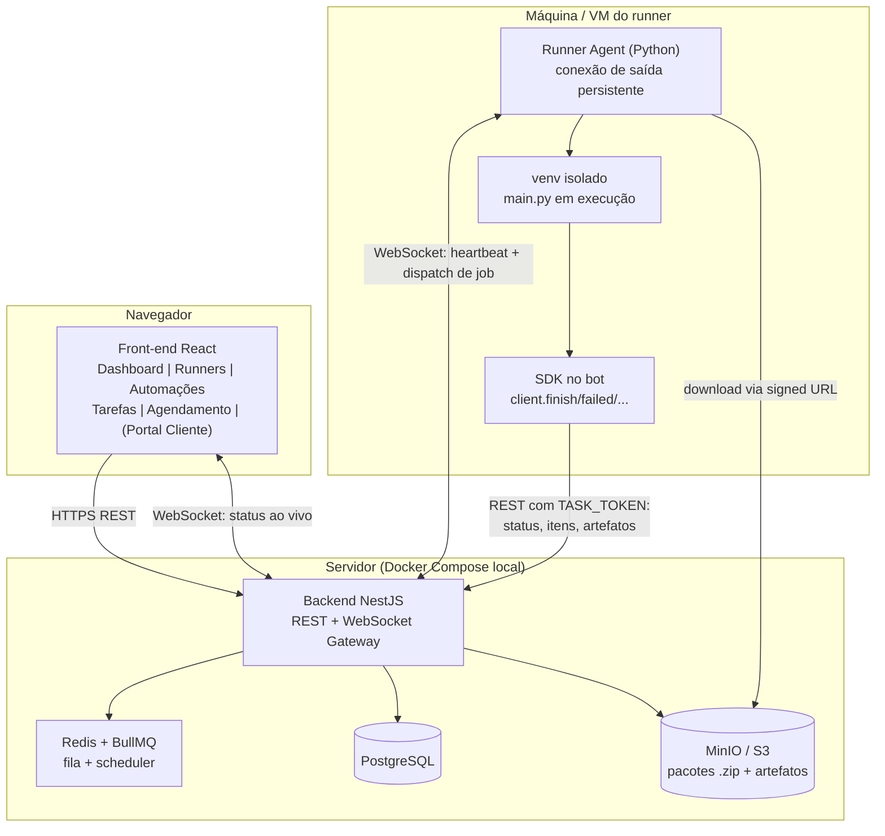

# Perseus — Documento de Arquitetura

> Plataforma de orquestração, agendamento, execução e monitoramento de bots
> (inicialmente em Python) em runners distribuídos.
>
> **Status:** planejamento / fundação
> **Última atualização:** 2026-06-05

---

## 1. Objetivo

Construir uma plataforma onde seja possível:

- Cadastrar **automações** e versionar seus **pacotes** (deploy).
- Conectar **runners** (máquinas) que reportam status em tempo real (online/offline).
- **Enviar tarefas** para execução (manual ou agendada), em runner específico ou via fila.
- **Conectar o código do bot via SDK**: `finish`, `failed`,
  total de itens processados, alertas, erros e upload de artefatos.
- **Dashboard** com métricas operacionais e **ROI** por automação.
- (Fase futura) **Portal do cliente** multi-tenant, onde o cliente roda apenas
  automações do repositório dele.

---

## 2. Decisões de arquitetura (fechadas)

| Tema | Decisão | Justificativa |
|---|---|---|
| Front-end | React + Vite + TypeScript + Tailwind + shadcn/ui + Recharts | Interface produtiva e moderna |
| Back-end | **NestJS** (Node + TypeScript) | Estrutura modular, WebSocket gateway, validação, filas nativas |
| Runner | **Python** | Mesmo runtime dos bots (cria venv, instala requirements) |
| Banco | PostgreSQL | Relacional, ideal para tarefas/agendamentos/ROI |
| Fila + Scheduler | Redis + BullMQ | Jobs e repeatable jobs (cron) |
| Storage | MinIO (S3-compatible) | Pacotes `.zip` e artefatos; local-first |
| Tempo real | WebSocket (Socket.IO) | Runner conecta por saída (atravessa firewall/NAT) |
| Deploy inicial | **Local-first com Docker Compose** | Subir tudo na máquina; nuvem depois |
| Multi-tenancy | **Projetado, adiado** | `workspace_id` presente nas entidades desde já |

---

## 3. Visão geral dos componentes



---

## 4. Estrutura do monorepo (proposta)

```
/
├── docker-compose.yml          # postgres + redis + minio (dev local)
├── ARCHITECTURE.md
├── apps/
│   ├── api/                    # Backend NestJS
│   ├── web/                    # Front-end React (Vite)
│   └── runner/                 # Agente Runner (Python)
├── packages/
│   └── sdk-python/             # SDK que o bot importa
└── examples/
    └── hello-bot/              # bot de exemplo (main.py + requirements + bot.json)
```

---

## 5. Comunicação Runner ↔ Backend

O runner fica em máquina possivelmente atrás de firewall/NAT. Portanto:

- **O runner inicia a conexão de saída** (WebSocket persistente). Nenhuma porta
  precisa ser aberta na máquina do cliente.
- **Autenticação:** cada runner registra-se com um **token de runner** (gerado no
  portal ao criar o runner) → mapeado para `runner_id`.
- **Heartbeat:** ping a cada ~10s. O backend atualiza `last_seen`; ausência de
  heartbeat por N segundos → status `OFFLINE`. (alimenta a tela "Runners")
- **Dispatch de tarefa:** ao acionar execução, o backend enfileira o job (BullMQ)
  e empurra para o runner alvo pelo WebSocket. Suporta **prioridade** e fila.
- **Fallback de polling:** se o WS cair, o runner faz polling de jobs pendentes.

### Eventos do canal WebSocket (runner)

| Direção | Evento | Payload |
|---|---|---|
| Runner → API | `runner.register` | token, hostname, os, capabilities |
| Runner → API | `runner.heartbeat` | runnerId, cpu/mem (opcional), runningTaskId |
| API → Runner | `task.dispatch` | taskId, automationId, version, downloadUrl, params, taskToken |
| Runner → API | `task.accepted` / `task.started` | taskId |
| Runner → API | `task.log` | taskId, chunk (streaming de stdout/stderr) |
| Runner → API | `task.finished` | taskId, status, exitCode |
| API → Runner | `task.cancel` | taskId |

---

## 6. Empacotamento e execução de bots

### 6.1 Estrutura padrão do pacote

```
meu-bot.zip
├── main.py            # ponto de entrada (configurável no manifesto)
├── requirements.txt   # dependências Python
├── bot.json           # manifesto
└── resources/         # arquivos auxiliares do bot (opcional)
```

### 6.2 Manifesto `bot.json`

```json
{
  "name": "cadastro-tabela-frete",
  "version": "1.0.3",
  "tech": "python",
  "pythonVersion": "3.11",
  "entrypoint": "main.py",
  "params": [
    { "key": "data_referencia", "type": "string", "required": true }
  ]
}
```

### 6.3 Ciclo de vida de uma execução

1. **Upload** do `.zip` → API valida `bot.json`, versiona e salva no MinIO.
2. **Nova tarefa** → escolhe automação + runner (ou Perseus escolhe runner livre).
3. **Dispatch** → runner recebe `task.dispatch` com `downloadUrl` (URL assinada) e `taskToken`.
4. Runner **baixa e descompacta** em diretório temporário isolado por `taskId`.
5. Runner **cria venv** e roda `pip install -r requirements.txt`.
6. Runner **injeta variáveis de ambiente**:
   - `PERSEUS_URL`, `TASK_ID`, `TASK_TOKEN`, mais os `params` da tarefa.
7. Runner **executa o entrypoint** (`python main.py`), faz streaming de log e captura exit code.
8. Bot **reporta via SDK** (status, itens, artefatos); runner emite `task.finished`.
9. Runner **limpa** venv/temp.

> **Isolamento:** v1 usa venv + diretório temporário por tarefa. Evolução futura:
> container Docker por tarefa para isolamento mais forte.

---

## 7. SDK Python

O bot importa o SDK; ele lê o token/URL injetados pelo runner e fala REST com a API.

```python
from perseus_sdk import PerseusClient

client = PerseusClient.from_env()  # lê PERSEUS_URL, TASK_ID, TASK_TOKEN

try:
    items = carregar_itens()
    processados, falhas = 0, 0
    for item in items:
        try:
            processar(item)
            processados += 1
        except Exception as e:
            falhas += 1
            client.error(e, context={"item": item.id})

    client.post_artifact("relatorio.xlsx")          # "Arquivos de Resultado"
    client.finish_task(status="SUCCESS",
                       total_items=len(items),
                       processed=processados,
                       failed=falhas)
except Exception as e:
    client.error(e)
    client.finish_task(status="FAILED")
```

### API consumida pelo SDK (autenticada por `TASK_TOKEN`)

| Método | Rota | Uso |
|---|---|---|
| POST | `/api/tasks/:id/start` | marca início |
| POST | `/api/tasks/:id/finish` | status + totais (itens/processados/falhas) |
| POST | `/api/tasks/:id/log` | append de log |
| POST | `/api/tasks/:id/alert` | alerta |
| POST | `/api/tasks/:id/error` | erro estruturado |
| POST | `/api/tasks/:id/artifacts` | upload de arquivo de resultado |

---

## 8. Modelo de dados (entidades principais)

> Toda entidade de negócio carrega `workspace_id` desde já (multi-tenant adiado mas pronto).

- **Workspace** — `id`, `name` (default workspace único na fase 1).
- **User** — `id`, `email`, `passwordHash`, `role` (`admin` | `operator` | `client`), `workspaceId`.
- **Repository** — `id`, `name` (`DEFAULT`), `workspaceId`.
- **Automation** — `id`, `name`, `label`, `description`, `repositoryId`, `roiConfig`.
- **BotVersion** — `id`, `automationId`, `version`, `releaseVersion`, `storageKey` (zip), `manifest`, `createdAt`.
- **Runner** — `id`, `label`, `token`, `status` (`ONLINE`/`OFFLINE`/`BUSY`), `lastSeen`, `host`, `workspaceId`.
- **Task** — `id`, `automationId`, `botVersionId`, `runnerId`, `state`
  (`QUEUED`/`RUNNING`/`FINISHED`/`FAILED`/`TIMEOUT`/`CANCELLED`), `priority`,
  `params`, `userId`, `totalItems`, `processed`, `failed`, `startedAt`, `finishedAt`.
- **Schedule** — `id`, `automationId`, `runnerTarget`, `cron`, `params`, `enabled`.
- **Artifact** — `id`, `taskId`, `name`, `storageKey`, `createdAt`.
- **TaskLog** — `id`, `taskId`, `seq`, `level`, `message`, `ts`.
- **AlertError** — `id`, `taskId`, `type` (`alert`|`error`), `payload`, `ts`.

---

## 9. Telas do front-end

1. **Central de Operações** — operação ao vivo (fila, runners online) + visão histórica.
2. **Runners** — lista com status, última atualização, (screenshot futuro).
3. **Automações** — CRUD, label, descrição, repositório.
4. **Robôs/Versões** — histórico de deploys e releases.
5. **Tarefas** — fila, estado, filtros; **Nova Tarefa**.
6. **Agendamento** — cron por automação.
7. **Arquivos de Resultado** — artefatos por tarefa.
8. **Alertas / Erros / Log de Execução**.
9. **Dashboard ROI** — economia calculada por automação.
10. (Futuro) **Portal do Cliente** — visão restrita por workspace.

---

## 10. Dashboard & ROI

Cards: Total de Tarefas, Agendamentos, Alertas, Erros,
Tarefas por Runner, Tarefas com falha.

**ROI por automação:** cadastra-se `tempoManualPorItem` (min) e `custoHora`.

```
economia_tempo = tempoManualPorItem * processed - tempoExecucaoRobo
economia_R$    = (economia_tempo / 60) * custoHora
```

Agregado por período no dashboard.

---

## 11. Segurança

- **Usuários:** JWT + refresh; RBAC (`admin`/`operator`/`client`).
- **Runner:** token único por runner; revogável.
- **Task token:** escopo apenas para a própria tarefa, expira ao finalizar.
- **Storage:** URLs assinadas com expiração curta para download/upload.
- **Isolamento de execução:** venv + dir temporário por tarefa (Docker no futuro).

---

## 12. Ambiente de desenvolvimento (local-first)

`docker-compose.yml` sobe:

- `postgres` (banco)
- `redis` (fila/scheduler)
- `minio` + console (storage de pacotes/artefatos)

API, Web e Runner rodam localmente apontando para esses serviços.
Caminho de nuvem (S3 + Postgres/Redis gerenciados) fica para fase posterior,
sem mudança de código (só configuração).

---

## 13. Roadmap por fases

| Fase | Entregável |
|---|---|
| 1. Fundação | Monorepo, docker-compose, schema do banco, auth, CRUD de Automações/Runners |
| 2. Runner MVP | Registro + heartbeat + status ao vivo no front (WebSocket) |
| 3. Deploy + Execução | Upload de zip, venv, run, captura/stream de log |
| 4. SDK | `finish`/`failed`/itens/alertas/erros/artefatos |
| 5. Fila + Agendamento | Prioridade, cron (BullMQ) |
| 6. Dashboard + ROI | Métricas e cálculo de ROI |
| 7. Portal do Cliente | Multi-tenant + permissões restritas |

---

## 14. Decisões em aberto (a revisitar)

- Isolamento por **Docker por tarefa** vs venv (custo x segurança).
- Múltiplas tecnologias de bot além de Python (Node, .NET) — manifesto já prevê `tech`.
- Estratégia de **screenshot do runner** — captura periódica opcional.
- Limites de concorrência por runner (1 tarefa por vez vs N).
