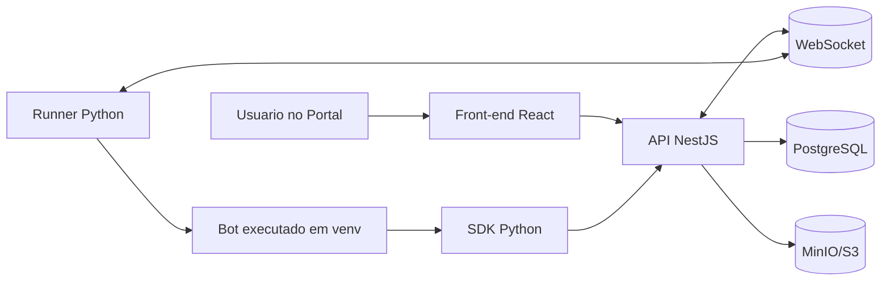
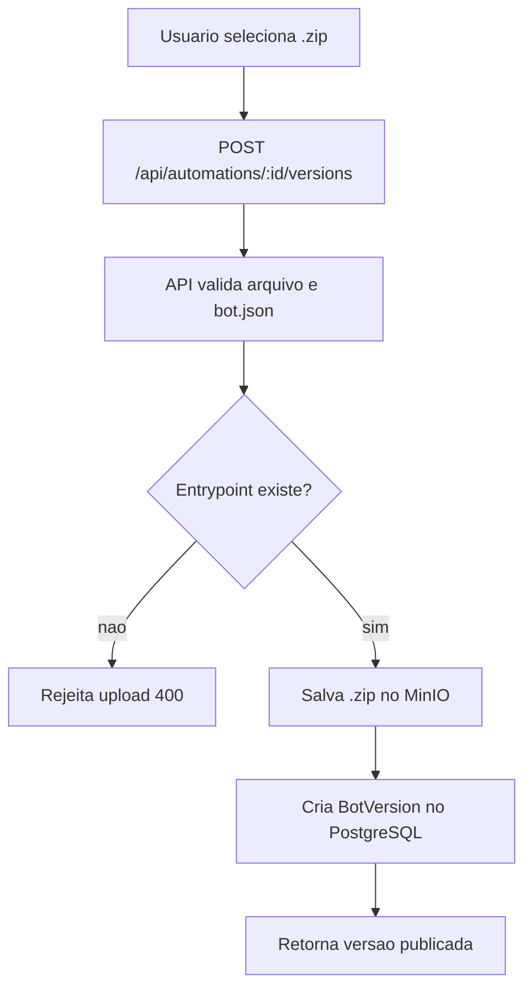
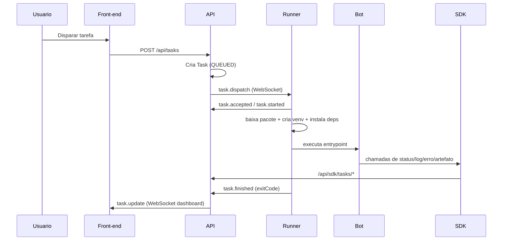
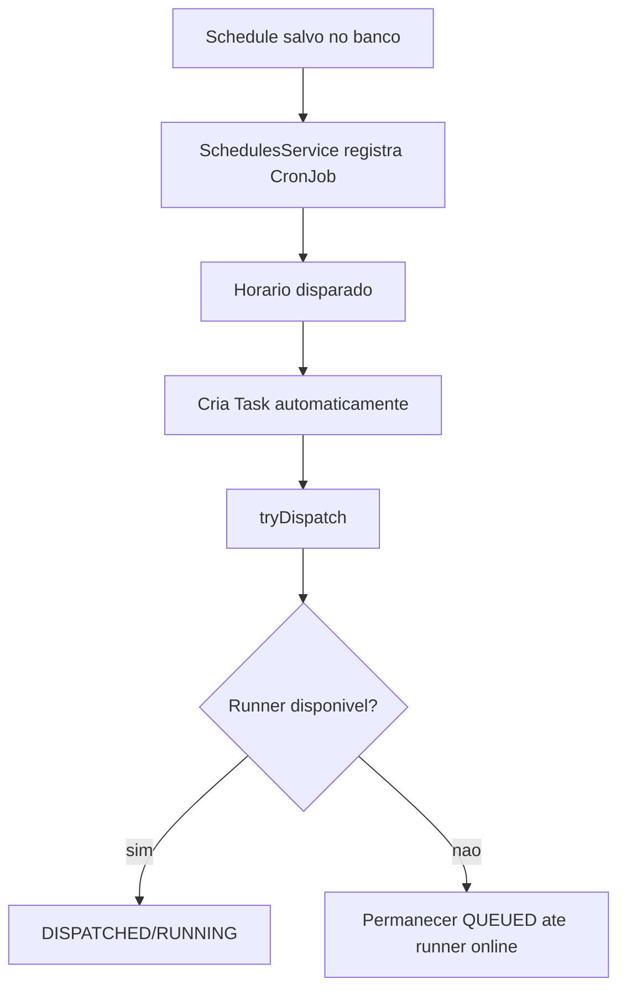
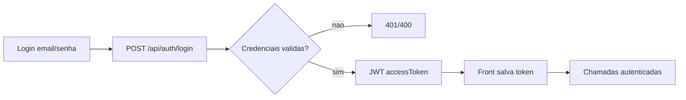
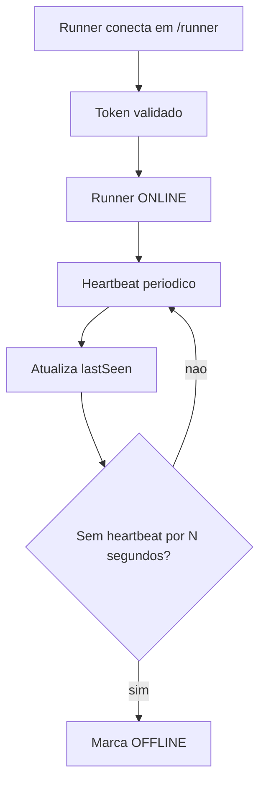

# Fluxogramas

## 1) Fluxo macro da plataforma

## 2) Fluxo de deploy de pacote

## 3) Fluxo de execucao de tarefa

## 4) Fluxo de agendamento (cron)

## 5) Fluxo de autenticacao

## 6) Fluxo de heartbeat do runner

