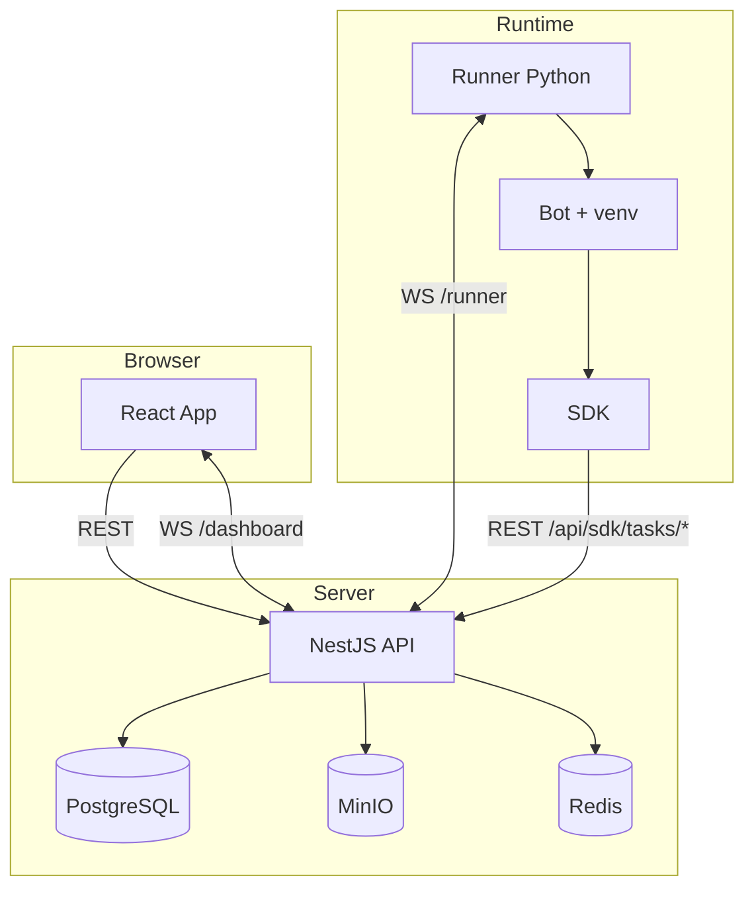

# Arquitetura do Sistema

## Objetivo

Orquestrar bots Python de forma centralizada, com deploy de pacotes, execucao remota por runners, agendamento, telemetria e dashboard operacional.

## Componentes

### Front-end (`apps/web`)

- SPA React com Vite e TypeScript.
- Interface para login, dashboard, runners, automacoes, tarefas e agendamento.
- Comunicacao:
  - REST para CRUD e operacoes transacionais.
  - WebSocket (`/dashboard`) para atualizacoes em tempo real.

### Back-end (`apps/api`)

- API NestJS modular.
- Responsavel por:
  - Autenticacao JWT e autorizacao por perfil.
  - CRUD de entidades de negocio.
  - Upload e versionamento de pacotes de bot.
  - Dispatch e ciclo de vida de tarefas.
  - Gateway WebSocket de runners e dashboard.
  - Scheduler cron e monitoramento de runners offline.

### Runner (`apps/runner`)

- Agente Python conectado por WebSocket de saida.
- Executa tarefas recebidas da API:
  - Download de pacote zip.
  - Extracao e criacao de venv isolado.
  - Instalacao de dependencias e SDK.
  - Execucao do entrypoint e envio de logs.

### SDK Python (`packages/sdk-python`)

- Biblioteca para o bot reportar:
  - inicio/fim da tarefa,
  - logs,
  - alertas/erros,
  - artefatos.
- Opera com `TASK_TOKEN` e `ORCHESTRATOR_URL`.

### Infra local

- PostgreSQL: persistencia principal.
- MinIO: armazenamento de pacotes e artefatos.
- Redis: previsto para fila/scheduler (evolutivo conforme arquitetura).

## Topologia de comunicacao

## Principios adotados

- **Conexao de saida do runner:** evita abertura de portas inbound no cliente.
- **Isolamento por tarefa:** venv e diretorio temporario por `taskId`.
- **Modularidade no backend:** separacao por dominio (auth, tasks, runners, etc.).
- **Estado observavel:** logs, eventos e artefatos persistidos.
- **Evolutividade:** estrutura pronta para multi-tenant e novas tecnologias de bot.

## Decisoes importantes

- Linguagem de execucao de bot inicial: Python.
- Upload em formato zip com manifesto `bot.json`.
- Tempo real por Socket.IO.
- Credenciais de dev seedadas para acelerar bootstrap local.
