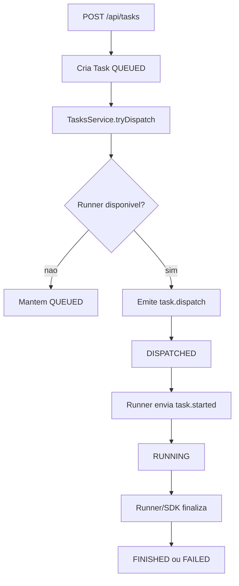

# Backend e API

## Visao geral

O backend em `apps/api` utiliza NestJS com Prisma para disponibilizar:

- autenticacao/autorizacao,
- orquestracao de tarefas,
- controle de runners,
- agendamento,
- dashboard e indicadores,
- endpoints para SDK do bot.

## Modulos principais

- `auth`: login, registro e identidade atual (`/auth/me`).
- `users`: listagem de usuarios.
- `automations`: CRUD de automacoes e repositorios.
- `bot-versions`: upload/lista/remocao de versoes de pacote.
- `runners`: CRUD de runners e token.
- `tasks`: criacao, consulta e cancelamento de tarefas.
- `schedules`: agendamento via cron.
- `dashboard`: agregacoes e metricas.
- `events`: gateways Socket.IO (`/runner` e `/dashboard`).
- `storage`: acesso MinIO/S3.
- `prisma`: acesso ao banco.

## Autenticacao e autorizacao

- JWT Bearer para endpoints de portal.
- `RolesGuard` para proteger operacoes administrativas.
- `TaskTokenGuard` para endpoints consumidos pelo SDK.

### Perfis previstos

- `ADMIN`
- `OPERATOR`
- `CLIENT` (uso futuro no portal multi-tenant)

## Contratos REST principais

### Auth

- `POST /api/auth/login`
- `POST /api/auth/register`
- `GET /api/auth/me`

### Automacoes e versoes

- `GET /api/automations`
- `POST /api/automations`
- `PATCH /api/automations/:id`
- `DELETE /api/automations/:id`
- `GET /api/automations/:automationId/versions`
- `POST /api/automations/:automationId/versions`
- `DELETE /api/automations/:automationId/versions/:versionId`

### Runners

- `GET /api/runners`
- `POST /api/runners`
- `PATCH /api/runners/:id`
- `POST /api/runners/:id/regenerate-token`
- `DELETE /api/runners/:id`

### Tarefas

- `GET /api/tasks`
- `GET /api/tasks/:id`
- `POST /api/tasks`
- `POST /api/tasks/:id/cancel`
- `GET /api/artifacts/:id/download`

### Agendamento e dashboard

- `GET /api/schedules`
- `POST /api/schedules`
- `PATCH /api/schedules/:id`
- `DELETE /api/schedules/:id`
- `GET /api/dashboard/summary`
- `GET /api/dashboard/live`

### Endpoints SDK

- `GET /api/sdk/tasks/current`
- `POST /api/sdk/tasks/start`
- `POST /api/sdk/tasks/log`
- `POST /api/sdk/tasks/alert`
- `POST /api/sdk/tasks/error`
- `POST /api/sdk/tasks/finish`
- `POST /api/sdk/tasks/artifacts`

## WebSocket

### Namespace `/runner`

Eventos recebidos do runner:

- `heartbeat`
- `task.accepted`
- `task.started`
- `task.log`
- `task.finished`

Eventos enviados ao runner:

- `task.dispatch`
- `task.cancel`

### Namespace `/dashboard`

Eventos para atualizacao de UI:

- `task.update`
- `task.log`
- `task.event`
- `task.artifact`
- `runner.status`

## Estados da tarefa

- `QUEUED`
- `DISPATCHED`
- `RUNNING`
- `FINISHED`
- `FAILED`
- `TIMEOUT`
- `CANCELLED`

Transicao tipica:

`QUEUED -> DISPATCHED -> RUNNING -> FINISHED|FAILED`

## Pipeline de execucao no backend

## Erros e padrao de resposta

- Validacoes via `class-validator` com `ValidationPipe`.
- Erros de dominio com exceptions NestJS (`BadRequestException`, `NotFoundException`, etc.).
- Respostas de erro padronizadas pelo Nest.
