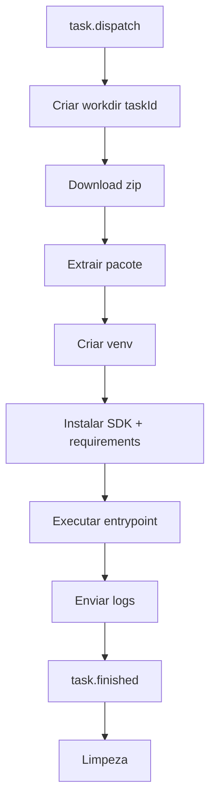

# Runner e SDK

## Runner (`apps/runner`)

## Responsabilidades

- Estabelecer conexao WebSocket com a API (`/runner`) usando token.
- Enviar heartbeat periodico para manter status ONLINE.
- Receber `task.dispatch`.
- Preparar ambiente de execucao da tarefa.
- Executar bot e reportar logs/estado final.

## Configuracao (`.env`)

- `PERSEUS_WS`
- `PERSEUS_API`
- `RUNNER_TOKEN`
- `HEARTBEAT_INTERVAL`
- `WORK_DIR`
- `PYTHON_BIN`
- `SDK_PATH`

## Ciclo de execucao local da tarefa

1. Criar pasta de trabalho por `taskId`.
2. Baixar zip do pacote via URL assinada.
3. Extrair conteudo.
4. Criar venv.
5. Instalar SDK (`SDK_PATH`) e `requirements.txt`.
6. Injetar variaveis (`TASK_TOKEN`, `TASK_ID`, `PERSEUS_URL`, etc.).
7. Executar entrypoint (`main.py` padrao).
8. Stream de stdout/stderr para `task.log`.
9. Enviar `task.finished` com `exitCode`.

## Fluxograma do runner



## SDK Python (`packages/sdk-python`)

## Objetivo

Padronizar a comunicacao do bot com o Perseus sem acoplamento ao runner.

## API publica principal

- `PerseusClient.from_env()`
- `start_task()`
- `log(message, level="info")`
- `alert(message, payload=None)`
- `error(error, context=None)`
- `finish_task(status="SUCCESS", total_items=None, processed=None, failed=None, message=None)`
- `post_artifact(file_path)`
- `current_task()`
- `get_params()`

## Integracao minima no bot

```python
from perseus_sdk import PerseusClient

client = PerseusClient.from_env()
client.start_task()
try:
    # logica do bot
    client.finish_task(status="SUCCESS", total_items=10, processed=10, failed=0)
except Exception as e:
    client.error(e)
    client.finish_task(status="FAILED")
```

## Modo offline

Se `PERSEUS_URL` e `TASK_TOKEN` nao estiverem presentes, o SDK entra em modo offline:

- nao interrompe a execucao do bot local,
- apenas imprime as acoes em stdout.

Isso facilita desenvolvimento e debug local sem o Perseus ativo.
