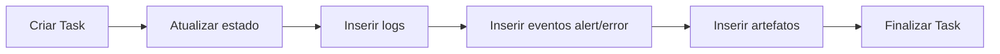

# Dados, Seguranca e Operacao

## Modelo de dados (Prisma)

Entidades principais:

- `Workspace`
- `User`
- `Repository`
- `Automation`
- `BotVersion`
- `Runner`
- `Task`
- `TaskLog`
- `EventLog`
- `Artifact`
- `Schedule`

## Relacoes-chave

- `Workspace` agrega usuarios, automacoes, runners, tarefas e schedules.
- `Automation` possui N `BotVersion` e N `Task`.
- `Task` referencia `Automation`, `Runner` e opcionalmente `BotVersion`.
- `Task` agrega `TaskLog`, `EventLog` e `Artifact`.

## Fluxo de persistencia de uma execucao

## Seguranca

### Credenciais e tokens

- JWT para usuarios do portal.
- Token por runner para autenticar conexao `/runner`.
- Task token de escopo restrito para SDK.

### Armazenamento

- Pacotes e artefatos em MinIO/S3.
- Download/upload via URL assinada com expiracao.

### Isolamento

- Execucao por tarefa em venv e diretorio dedicado.
- Evolucao recomendada: container por execucao para isolamento mais forte.

## Observabilidade

- Logs de tarefa persistidos em `TaskLog`.
- Eventos funcionais em `EventLog`.
- Atualizacao em tempo real para dashboard via websocket.
- Indicadores agregados em `dashboard/summary`.

## Operacao local

Servicos de infra:

- `postgres` (5432)
- `redis` (6379)
- `minio` (9000)
- `minio-console` (9001)

Aplicacoes:

- API: `http://localhost:3000/api`
- Web: `http://localhost:5173`

Credenciais dev seed:

- `admin@local` / `admin123`

## Limites atuais e evolucoes

- Concorrencia de runner: comportamento atual prioriza simplicidade.
- Multi-tenant: estrutura de dados preparada, portal cliente evolutivo.
- Telemetria de infraestrutura: ainda sem stack dedicada (Prometheus/Grafana).
